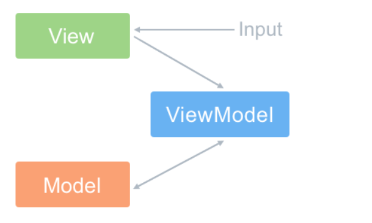
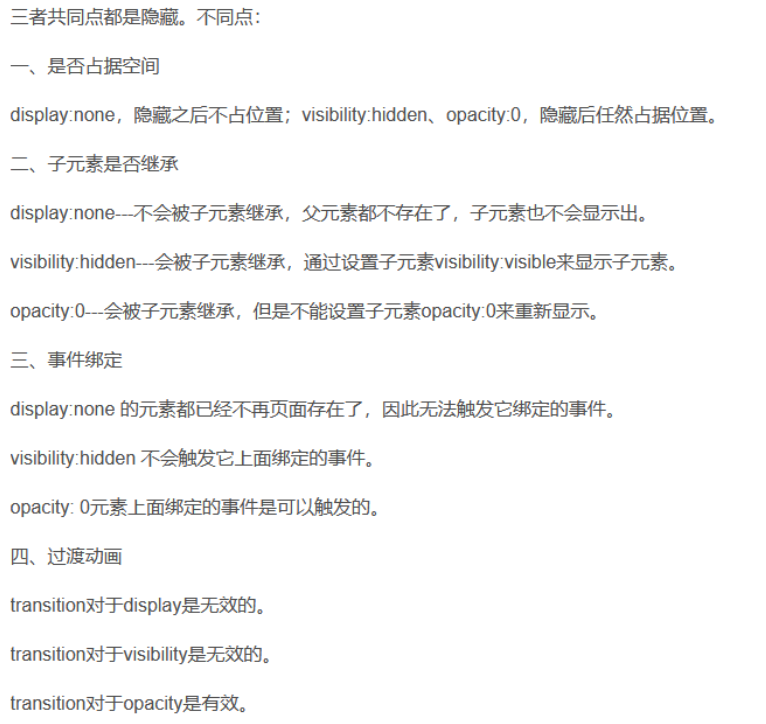
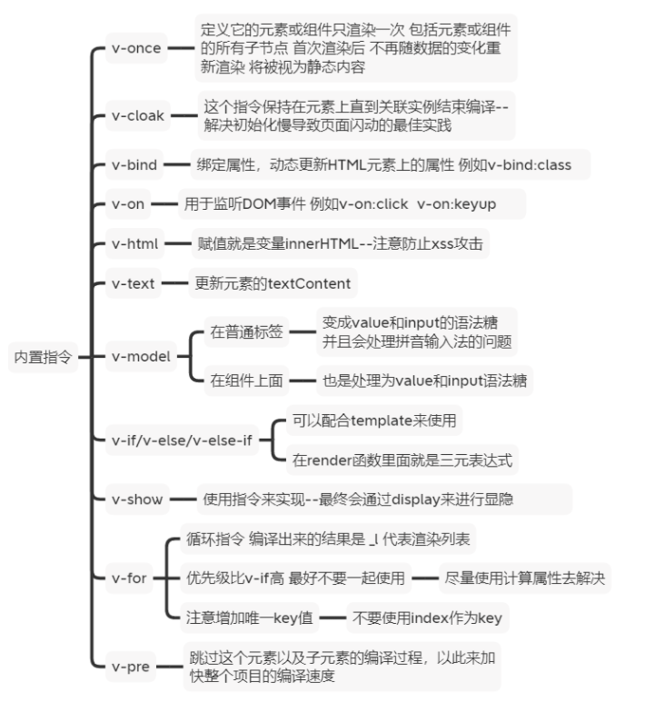

# vue面试官总结题

> 本文分为三个阶段：简单、中等和困难；望汝虽立于皓月之边，不弱星光之势，傍于巨人身侧，不颓好胜之心。

<!-- more -->

## 简单篇

### 1、MVC 和 MVVM 区别

**MVC**

MVC 全名是 Model View Controller，是模型(model)－视图(view)－控制器(controller)的缩写，一种软件设计典范。

- Model（模型）：是应用程序中用于处理应用程序数据逻辑的部分。通常模型对象负责在数据库中存取数据
- View（视图）：是应用程序中处理数据显示的部分。通常视图是依据模型数据创建的
- Controller（控制器）：是应用程序中处理用户交互的部分。通常控制器负责从视图读取数据，控制用户输入，并向模型发送数据

MVC 的思想：一句话描述就是 Controller 负责将 Model 的数据用 View 显示出来，换句话说就是在 Controller 里面把 Model 的数据赋值给 View。

**MVVM**

MVVM 新增了 VM 类

- ViewModel 层：做了两件事达到了数据的双向绑定 一是将【模型】转化成【视图】，即将后端传递的数据转化成所看到的页面。实现的方式是：数据绑定。二是将【视图】转化成【模型】，即将所看到的页面转化成后端的数据。实现的方式是：DOM 事件监听。

MVVM 与 MVC 最大的区别就是：它实现了 View 和 Model 的自动同步，也就是当 Model 的属性改变时，我们不用再自己手动操作 Dom 元素，来改变 View 的显示，而是改变属性后该属性对应 View 层显示会自动改变（对应Vue数据驱动的思想）。

整体看来，MVVM 比 MVC 精简很多，不仅简化了业务与界面的依赖，还解决了数据频繁更新的问题，不用再用选择器操作 DOM 元素。因为在 MVVM 中，View 不知道 Model 的存在，Model 和 ViewModel 也观察不到 View，这种低耦合模式提高代码的可重用性。

> 注意：Vue 并没有完全遵循 MVVM 的思想 这一点官网自己也有说明

> 严格的 MVVM 要求 View 不能和 Model 直接通信，而 Vue 提供了$refs 这个属性，让 Model 可以直接操作 View，违反了这一规定，所以说 Vue 没有完全遵循 MVVM。

### 2、为什么 data 是一个函数

组件中的 data 写成一个函数，数据以函数返回值形式定义，这样每复用一次组件，就会返回一份新的 data，类似于给每个组件实例创建一个私有的数据空间，让各个组件实例维护各自的数据。而单纯的写成对象形式，就使得所有组件实例共用了一份 data，就会造成一个变了全都会变的结果。

### 3、Vue 组件通讯有哪几种方式

- props 和 $emit 父组件向子组件传递数据是通过 prop 传递的，子组件传递数据给父组件是通过$emit 触发事件来做到的
- $parent,$children 获取当前组件的父组件和当前组件的子组件
- $attrs 和 $listeners A->B->C。Vue 2.4 开始提供了 $attrs 和$listeners 来解决这个问题
- 父组件中通过 provide 来提供变量，然后在子组件中通过 inject 来注入变量。(官方不推荐在实际业务中使用，但是写组件库时很常用)
- $refs 获取组件实例
- envetBus 兄弟组件数据传递 这种情况下可以使用事件总线的方式
- vuex 状态管理

### 4、Vue 的生命周期方法有哪些 一般在哪一步发请求

- beforeCreate 在实例初始化之后，数据观测(data observer) 和 event/watcher 事件配置之前被调用。在当前阶段 data、methods、computed 以及 watch 上的数据和方法都不能被访问
- created 实例已经创建完成之后被调用。在这一步，实例已完成以下的配置：数据观测(data observer)，属性和方法的运算， watch/event 事件回调。这里没有$el,如果非要想与 Dom 进行交互，可以通过 vm.$nextTick 来访问 Dom
- beforeMount 在挂载开始之前被调用：相关的 render 函数首次被调用。
- mounted 在挂载完成后发生，在当前阶段，真实的 Dom 挂载完毕，数据完成双向绑定，可以访问到 Dom 节点
- beforeUpdate 数据更新时调用，发生在虚拟 DOM 重新渲染和打补丁（patch）之前。可以在这个钩子中进一步地更改状态，这不会触发附加的重渲染过程
- updated 发生在更新完成之后，当前阶段组件 Dom 已完成更新。要注意的是避免在此期间更改数据，因为这可能会导致无限循环的更新，该钩子在服务器端渲染期间不被调用。
- beforeDestroy 实例销毁之前调用。在这一步，实例仍然完全可用。我们可以在这时进行善后收尾工作，比如清除计时器。
- destroyed Vue 实例销毁后调用。调用后，Vue 实例指示的所有东西都会解绑定，所有的事件监听器会被移除，所有的子实例也会被销毁。 该钩子在服务器端渲染期间不被调用。
- activated keep-alive 专属，组件被激活时调用
- deactivated keep-alive 专属，组件被销毁时调用

> 异步请求在哪一步发起？

可以在钩子函数 created、beforeMount、mounted 中进行异步请求，因为在这三个钩子函数中，data 已经创建，可以将服务端端返回的数据进行赋值。

如果异步请求不需要依赖 Dom 推荐在 created 钩子函数中调用异步请求，因为在 created 钩子函数中调用异步请求有以下优点：

- 能更快获取到服务端数据，减少页面  loading 时间；
- ssr 不支持 beforeMount 、mounted 钩子函数，所以放在 created 中有助于一致性；ssr 渲染只有两个钩子函数 beforeCreated 和 created

## 5、v-if 和 v-show 的区别

- v-if 在编译过程中会被转化成三元表达式,条件不满足时不渲染此节点。
- v-show 会被编译成指令，条件不满足时控制样式将对应节点隐藏 （display:none）

**使用场景**

- v-if 适用于在运行时很少改变条件，不需要频繁切换条件的场景
- v-show 适用于需要非常频繁切换条件的场景

> 扩展补充：display:none、visibility:hidden 和 opacity:0 之间的区别？

### 6、说说 vue 内置指令

### 7、怎样理解 Vue 的单向数据流

数据总是从父组件传到子组件，子组件没有权利修改父组件传过来的数据，只能请求父组件对原始数据进行修改。这样会防止从子组件意外改变父级组件的状态，从而导致你的应用的数据流向难以理解。

> 注意：在子组件直接用 v-model 绑定父组件传过来的 prop 这样是不规范的写法 开发环境会报警告

如果要改变父组件的 prop 值 可以再 data 里面定义一个变量 并用 prop 的值初始化它 之后用$emit 通知父组件去修改

### 8、computed 和 watch 的区别和运用的场景

- computed 是计算属性，依赖其他属性计算值，并且 computed 的值有缓存，只有当计算值变化才会返回内容，它可以设置 getter 和 setter。
- watch 监听到值的变化就会执行回调，在回调中可以进行一些逻辑操作。

计算属性一般用在模板渲染中，某个值是依赖了其它的响应式对象甚至是计算属性计算而来；而侦听属性适用于观测某个值的变化去完成一段复杂的业务逻辑

### 9、v-if 与 v-for 为什么不建议一起使用

v-for 和 v-if 不要在同一个标签中使用,因为解析时先解析 v-for 再解析 v-if。如果遇到需要同时使用时可以考虑写成计算属性的方式。

## 中等